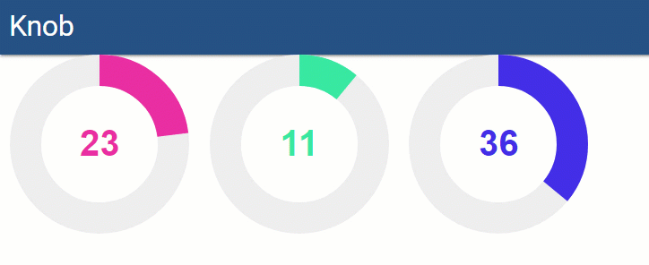

# ud-knob
Knob control for Universal Dashboard

[Download](https://ironmansoftware.com/product/knob/)

## Example 

```
Import-Module UniversalDashboard 

Get-UDDashboard | Stop-UDDashboard
Start-UDDashboard -Dashboard (
    New-UDDashboard -Title "Knob" -Content {
        New-UDRow -AutoRefresh -RefreshInterval 1 -Endpoint {
            $Time = Get-Date
            New-UDColumn -Content {
                New-UDKnob -Value $Time.Hour
            }
            New-UDColumn -Content {
                New-UDKnob -Value $Time.Minute -ForegroundColor "#38E8A1"
            }
            New-UDColumn -Content {
                New-UDKnob -Value $Time.Second -ForegroundColor "#442EE8"
            }
        }        
    } -EndpointInitialization (New-UDEndpointInitialization -Module "UniversalDashboard.Knob") 
)   -Port 10001
```



## Properties
| name | description | default |
|------|-------------|---------|
|`value`|numeric value of knob|n/a|
|`minimum`|min value|`0`|
|`maximum`|max value|`100`|
|`step`|step size|`1`|
|`logarithmicScale`|enable logarithmic scale (must use non-zero `min` and `max`, `step` > 1)|`false`|
|`width` or `height`|dimension of square (px)|`200`|
|`thickness`|gauge thickness|`0.35`|
|`lineCap`|gauge stroke ending style (`butt` or `round`)|`'butt'`|
|`backgroundColor`|background color|`'#EEE'`|
|`foregroundColor`|foreground color|`'#EA2'`|
|`font`|font family|`'Arial'`|
|`fontWeight`|font weight|`'bold'`|
|`counterClockwise`|direction of progression|`false`|
|`angleArc`|arc size in degrees|`360`|
|`angleOffset`|starting angle in degrees|`0`|
|`title`|adds title attribute to the wheel|`value`|
